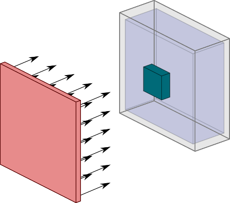
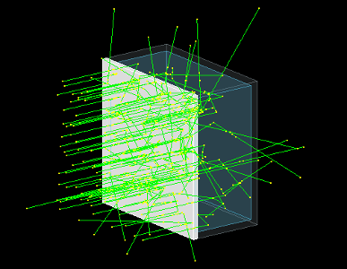
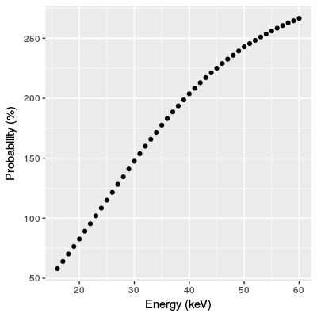
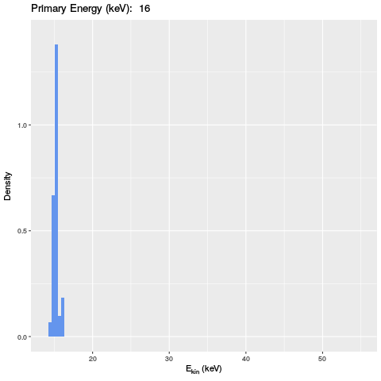
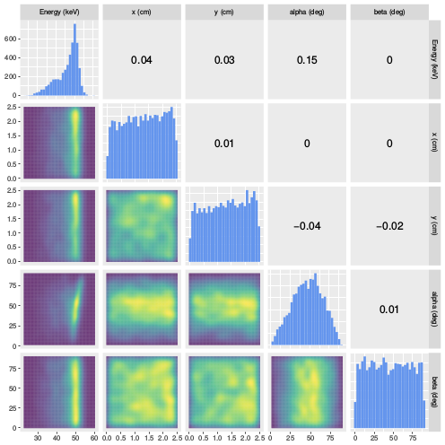

# PMMA Phantom Backscattering Analysis

### 27th March 2018

---

## Setup Description
PMMA phantom filled with water is irradiated with a monoenergetic photon field which is oriented perpendicular to the phantom's surface

---

## Problem Description

From $N$ photons only $\approx 6\cdot 10^{-7} N$ are detected. 
$\rightarrow$ Leads to extremely long calculation times

#### Reasons:

+ Photons are traversing the phantom
+ Photons are backscattering from the phantom but don't reach the detector at all
+ Photons hit the detector but are not detected due to its efficiency of about 1%

#### Solution:

Analyse the characteristics of the backscattered photons in order to exchange the whole phantom in the simulation with an equivalent but more efficient source

---

## Simulation of the Phantom Setup

+ Using GEANT4 for the construction of the geometry and simulation of the photons
+ A detector is put in front of the phantom which is transparent for incoming particles, but totally absorbes backscatterd photons
+ All important properties of the detected photons are logged

#### Important simulation requirement:

Need to only consider backscattering photons: area where the dosemeter sits on the phantom must not be irratiated 

---

## Photons Traversing the Phantom

+ Simulation is executed with a detector spanning the area of the whole phantom 
+ Shown is the probability to detect photons in the setup
+ With increasing energy, less photons are able to traverse the phantom undetected

---

## Dosemeter Bounding Box (DBB)

- Create box surrounding the dosemeter in later simulations
- Acts as a surface at which no primary particles are allowed to enter the phantom
- Can also be used as an detector to later sample events from its surface to its inside

---

## Photons Reaching the DBB

Probability to reach the dosemeter bounding box as a function of the primary energy of the photons.

---

## Energy Distribution of Backscattered Photons

- Increasing primary energy of photon field yields to broadening of backscattered photon energy
- Number of reflected photons at the phantom's surface decreases with increasing primary energy

---

## Energy Distribution of Backscattered Photons

---

## Possible Sampling Method: Probability Density Function

Need a method to generate events with a high probability of detection

- In the best case, all photon attributes are uncorrelated

  $\rightarrow$ Simply sample the attributes from one-dimensional distributions

- Need to investigate correlation of attributes first

---

## Correlation Analysis of Phantom Backscattering

**Setup**: Phantom-sized absorber with rejected area at DBB

**Primary Energy**: 60 keV

Here, $\alpha$ is the angle between the direction of the photon, $\vec p$, and the surface normal of the phantom, $\vec n$

---

## Correlation Analysis DBB (Top)

**Setup**: top of DBB

**Primary Energy**: 60 keV

---

## Correlation Analysis DBB (Back)

**Setup**: back of DBB

**Primary Energy**: 60 keV

---

## Correlation Analysis Results

- Phantom-sized detector: 
  + Only a few attributes 
  + Correlation of $E_{\mathrm{kin}}$ and $\alpha$ 
  + Would need heavy rejection sampling
- DBB: 
  + Many attributes
  + High correlation of the attributes

$\rightarrow$ Not sufficiently applicable

---

## Possible Sampling: n-dim. Kernel Density Estimation

*Kernel*: positive function $K(x;\ h)$ controlled by bandwidth $h$

*Density estimate*: at point $y$ within group of points $x_i$ 

$$\rho_K = \sum_{i=1}^N K((y - x_i)/h)$$

*Bandwidth* $h$: Smoothing parameter, controlling tradeoff between bias and variance 

[Source: scikit-learn](http://scikit-learn.org/stable/modules/density.html)

---

## KDE Solution

- Use events which hit the dosemeter bounding box and which have the $n$ attributes: $\vec x,\, \vec p,\ E_\mathrm{kin}$

- Instead of directly sampling events, smooth their distribution via *KDE*

  $\rightarrow$ Establish continuity of PDE

#### Procedure:

- Use Gaussian kernel
- Sample single event from dataset and randomly sample from the $n$-dimensional kernel
- Distribution of the so sampled events equals the KDE of the whole data